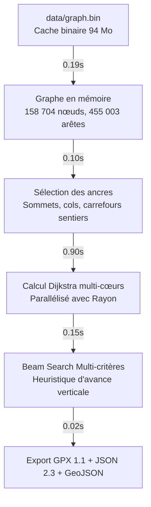

# runroute (v2 - Rust)

> Générateur d'itinéraires de course à pied et trail haute performance pour Lyon et les Monts d'Or en **Rust**.
> Version ultra-rapide (**~1.5 à 2 secondes** contre 80–90 secondes en Python) avec parité stricte des exports GPX et JSON.

---

## 🤖 Guide Principal pour Agents IA (Skill & Autonomous Operations)

> **Pour tout assistant ou agent IA (Claude, GPT, Antigravity, Copilot, Cursor, etc.)** :
> Cette section constitue le protocole d'utilisation officiel pour opérer `runroute` de manière autonome et fiable depuis n'importe quel environnement.
> Le skill complet est également disponible dans [`.agents/skills/runroute/SKILL.md`](.agents/skills/runroute/SKILL.md).

### 1. Protocole de lancement rapide

1. **Compilation du binaire optimisé :**
   ```bash
   cargo build --release
   ```
   Le binaire autonome est produit dans `./target/release/runroute`.

2. **Génération standard (ex: 21 km / 900 m D+ depuis la station Vélo'v Carret) :**
   ```bash
   ./target/release/runroute route \
     --start carret_sedallian \
     --profile trail_drills \
     --distance 21 \
     --dplus 900 \
     -v
   ```

3. **Validation automatique des résultats :**
   - Le statut affiché doit comporter l'icône `✔` (`compliant: true`).
   - Le décalage de distance doit être inférieur à $\pm 5\%$.
   - Le recouvrement (*overlap*) doit être $\le 10\%$ (idéalement $0-8\%$).
   - Les sorties produites dans `gpx/` sont :
     - `YYYY-MM-DD_<name>.gpx` : trace GPX 1.1 avec waypoints et altitudes lissées.
     - `YYYY-MM-DD_<name>.json` : rapport d'analyse complet conforme au **schéma 2.3**.
     - `YYYY-MM-DD_<name>.alternatives.geojson` : alternatives visualisables sur carte.

---

### 2. Matrice des profils sportifs

| Profil | Poids D+ | Poids D- | Revêtement prioritaire | Recouvrement max | Usage recommandé |
| :--- | :---: | :---: | :--- | :---: | :--- |
| `trail_drills` | 1.0 | 1.0 | **Sentiers & chemins** (*trail-first*) | 25% | Séance trail spécifique, crêtes, singletracks |
| `long_run` | 1.8 | 1.2 | **Sentiers & chemins** (*trail-first*) | 15% | Sortie longue d'endurance, boucle maximale |
| `rolling` | 2.0 | 1.5 | **Équilibré** (chemins & routes calmes) | 20% | Parcours vallonné modéré |
| `flat` | 8.0 | 5.0 | **Bitume roulant** (*paved-first*) | 20% | Footing de récupération, berges de Saône |
| `threshold` | 4.0 | 3.0 | **Bitume roulant** (*paved-first*) | 25% | Séances tempo / allure seuil régulier |
| `hills` | 0.4 | 0.6 | **Équilibré** (répétitions autorisées) | 80% | Séances de côtes / fractionné en montée |

---

### 3. Référence des arguments CLI

```
./target/release/runroute route [OPTIONS]
```

- `--start <POINT_OU_COORD>` : Point de départ configuré (`home`, `carret_sedallian`, `couzon`, `ile_barbe`) ou coordonnées GPS libres `lat,lon` (ex: `45.7924,4.8205`).
- `--profile <PROFIL>` : Un des 6 profils ci-dessus (défaut: `trail_drills`).
- `--distance <KM>` : Distance cible en kilomètres (ex: `21.0`). Fenêtre de tolérance : $\pm 5\%$.
- `--dplus <METRES>` : Dénivelé positif cible en mètres.
  - *Optionnel* : si non spécifié, le D+ est ajusté naturellement au profil.
  - *Pour maximiser le D+* : passer un seuil ambitieux (ex: `--dplus 1100`). Le moteur applique un bonus aux sentiers raides et classe le parcours avec le dénivelé maximal en rang 1.
- `--route-mode <natural|vertical>` :
  - `natural` (défaut) : Vraie boucle continue sans aucun demi-tour immédiat ni cul-de-sac.
  - `vertical` : Autorise les répétitions sur une même montée pour les séances de travail en côte.
- `--name <LIBELLÉ>` : Préfixe personnalisé pour les fichiers exportés.
- `--data-dir <CHEMIN>` : Répertoire contenant `graph.bin` / `graph.graphml` (défaut: `data/`).
- `--output-dir <CHEMIN>` : Répertoire d'export (défaut: `gpx/`).
- `-v, --verbose` : Affiche les jalons d'exécution chronométrés.

---

### 4. Procédures Opérationnelles Standards (SOP) pour l'IA

#### SOP A : Maximiser le D+ sur une distance donnée (ex: 21 km)
1. Sélectionner le profil `trail_drills`.
2. Passer `--distance 21 --dplus 1100`.
3. Le moteur active l'exploration approfondie à 14 sauts et le bonus d'avance verticale pour enchaîner les sommets des Monts d'Or (Mont Cindre, Mont Thou, Mont Verdun, Croix Rampau).
4. Fournir à l'utilisateur :
   - Le D+ officiel RGE ALTI (lissé gpx.studio) : ~936–973 m.
   - Le D+ brut estimé sur montre (COROS, Garmin, Strava) : ~1 000–1 050 m.

#### SOP B : Ajouter une nouvelle adresse ou un point de départ
Éditer [`runroute.toml`](runroute.toml) sous la section `[points]` :
```toml
[points]
home = [45.786902, 4.7896771]
nouveau_point = [45.812345, 4.823456]
```
Le point est immédiatement disponible via `--start nouveau_point`.

#### SOP C : Rafraîchissement du cache binaire
En cas de modification de `data/graph.graphml` :
```bash
./target/release/runroute convert --data-dir data
```
Le cache rapide `data/graph.bin` est régénéré en ~3 secondes.

---

## ⚡ Architecture & Performances



### Comparatif direct des temps d'exécution (21 km / 900 m D+)

| Étape | Python (historique) | Rust (`runrouteV2`) | Facteur de gain |
| :--- | :---: | :---: | :---: |
| **Chargement du graphe** | 35 – 40 s | **0.19 – 0.23 s** | **~180x** |
| **Dijkstra multi-critères** | 30 – 50 s | **0.90 – 1.60 s** | **~30x** |
| **Beam search & métriques** | 10 – 15 s | **< 0.15 s** | **~80x** |
| **Temps total** | **75 – 90 s** | **1.60 – 2.30 s** | **~50x plus rapide** ⚡ |

---

## 🧪 Tests automatiques

```bash
cargo test
```
Exécute la suite de tests unitaires (projections géodésiques Lambert-93 EPSG:2154, calculs métriques, profils et pondérations).
