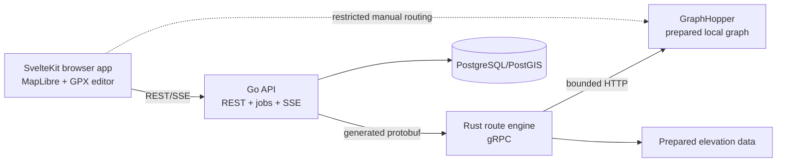

# Intelligent Trail Route Engine architecture

## Scope

This repository extends the preserved gpx.studio editor with deterministic running and trail-running route generation. The editor remains the only GPX model and editing surface. Candidate routes are transient until the user selects one; selection creates an ordinary `GPXFile` through the existing action manager.

## Components

### Preserved TypeScript packages

- `gpx/`: parsing, serialization, `GPXFile → Track → TrackSegment → TrackPoint`, waypoints, statistics, and simplification.
- `website/`: SvelteKit UI, MapLibre map, manual routing, elevation chart, browser persistence, undo/redo, and export.
- New candidate previews use bounded temporary GeoJSON sources/layers. They do not enter Dexie or the GPX file list.
- Selection converts candidate geometry and metadata to the existing GPX model through one action-manager transaction.
- Manual edits update local geometry immediately, mark canonical analysis stale, and trigger asynchronous reanalysis after Phase 4.

### Go API

`services/api/` is the only public backend. It owns HTTP validation, problem responses, database transactions, search/job lifecycle, persistence, cancellation, event retention, SSE, and calls to the Rust service. It never implements route optimization and never logs precise start, destination, or saved-place coordinates operationally.

Public values use UUID identifiers, integer metres, and tolerance basis points. Errors use `application/problem+json`. Search limits come from versioned server configuration, not caller-controlled unbounded values.

### Rust route engine

`services/route-engine/` owns deterministic anchor generation, provider normalization, geometry/elevation analysis, constraints, scoring, overlap, diversity, and CPU-heavy search. It exposes only generated protobuf gRPC services. It owns no accounts, browser state, public HTTP routes, or business persistence.

GraphHopper and elevation responses are normalized behind provider interfaces. Core search code must not depend on provider JSON or make per-point external API calls.

### GraphHopper and data

GraphHopper owns pedestrian access rules, snapping, low-level routing, and path details. Prepared OSM and elevation data are explicit, versioned inputs stored on persistent volumes. Normal startup validates them and fails truthfully when absent; it never downloads a PBF or builds a graph.

PostGIS stores application and spatial business state. It does not duplicate GraphHopper's routing graph.

## Contracts

A single versioned protobuf package defines `Check`, streaming `GenerateRoutes`, and `AnalyzeRoute`. Generated Go and Rust bindings are the only RPC DTOs. Contract generation is reproducible and checked for lint and breaking changes.

The browser talks only to Go:

- `GET /api/v1/health`
- `POST /api/v1/routes/preview`
- `POST /api/v1/searches`
- `GET|DELETE /api/v1/searches/{id}`
- `GET /api/v1/searches/{id}/results`
- `POST /api/v1/routes/analyze`
- `GET /api/v1/searches/{id}/events`

SSE is a projection of persisted, monotonic search events. `Last-Event-ID` resumes after the supplied sequence. Heartbeats do not consume durable sequence numbers. Terminal events close the stream.

## Search lifecycle

1. Go validates the request, assigns a seed when absent, stores the search and job atomically, then returns `202 Accepted` with status and result URLs.
2. A worker claims one available job with `FOR UPDATE SKIP LOCKED`, records its lease/attempt, and opens the Rust stream.
3. Rust snaps the start, prepares a bounded region, then emits deterministic topology/anchor batches derived from the seed and versioned configuration.
4. A bounded provider pool routes anchors through GraphHopper. Rust normalizes path geometry, access, and path details before analysis.
5. Rust computes canonical metrics, applies non-degradable hard constraints, scores acceptable candidates, adapts search radii/biases, and maintains a diverse podium.
6. Cancellation, deadline, routing-call, candidate, and CPU/concurrency budgets stop further work. The best known result is returned only under the request's degradation policy.
7. Go batches durable events and candidates, marks the terminal state, and exposes results. A cancelled or disconnected gRPC context propagates promptly to provider work.

## Data model

The initial PostGIS migration contains only the active vertical slice:

- `route_searches`: validated request, state, seed, versions, limits, timestamps, timings, and safe failure details.
- `generation_jobs`: search reference, state, attempt count, availability, claim/lease metadata.
- `route_candidates`: rank, `LineStringZ`, canonical metrics, score breakdown, warnings, stable segment IDs, degradation state, and generation duration.
- `search_events`: `(search_id, sequence)` key, typed compact payload, occurrence time, and retention eligibility.

Spatial columns use GiST indexes. Job/status/time access paths use B-tree or partial indexes. Writes are batched; route points are never queried or persisted one at a time.

## Invariants

- Access, privacy, continuity, active closure, and safety constraints are never degraded.
- Degraded mode may relax only distance/ascent target tolerances and reports every violation.
- Equal input, seed, dataset, algorithms, and configuration versions produce the same ordered podium.
- Every external call and work queue is bounded and cancellable.
- Candidate comparison does not mutate persistent GPX state.
- Server elevation becomes canonical in Phase 4; provider and algorithm versions accompany metrics.
- No service returns hard-coded dependency health.

## Deployment and operations

Compose runs `website`, `api`, `route-engine`, `graphhopper`, and `postgres-postgis`. The website container serves static SvelteKit output and proxies `/api` to Go plus a restricted `/routing` surface for existing manual editing. Routing graphs, source PBFs, DEM inputs, and database files use persistent volumes.

Health is dependency-specific and truthful:

- website readiness checks its served HTTP surface;
- Go reports database connectivity, Rust `Check`, GraphHopper capability, and dataset identity;
- Rust `Check` probes the configured routing/elevation providers and reports their versions;
- GraphHopper and Postgres use native readiness checks.

Sensitive coordinates are excluded from routine logs and health responses. Detailed search-event retention is configurable.

## Verification strategy

- GPX/frontend unit tests: conversion, validation, candidate layers, selection, warnings/scores, stale analysis.
- Go tests: validation, transactions/jobs, gRPC mapping, cancellation, SSE resume, safe errors/logging.
- Rust tests: deterministic anchors, geometry/elevation, constraints, scoring, overlap/diversity, degradation.
- Contract checks: Buf lint, generated-binding reproducibility, breaking detection.
- Integration fixture: small versioned OSM/DEM data through real GraphHopper → Rust → Go.
- Browser flows: generate, compare, select, edit, reanalyze, export, and parser round-trip.
- Golden scenarios assert ranges and invariants rather than exact geometry.

Architecture decisions are recorded in `docs/adr/`. Baseline constraints and provenance are recorded in `docs/BASELINE.md` and `docs/UPSTREAM.md`.
