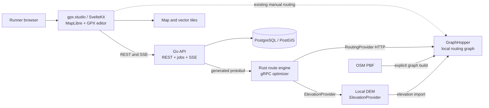

# Intelligent Trail Route Engine — Implementation Plan

> Status date: 2026-09-01  
> Upstream base inspected and imported: `gpxstudio/gpx.studio` `main` at `6a0d4343718e01637a8e301251977fb218cf88f8`  
> Overall status: Phase 0 complete; Phase 1 implemented but runtime acceptance blocked; Phases 2–12 not started

## 1. Objective and MVP

Extend gpx.studio into a production-quality running and trail-running route generator. Preserve its SvelteKit editor, MapLibre map, GPX model, manual editing, elevation chart, browser persistence, and export workflow. Add an intelligent engine that generates routes for a training objective rather than merely finding the shortest path.

The first MVP is complete when a runner can click a start, request a 15 km / 500 m D+ `TRAIL_LONG_RUN` in `NATURAL` mode, compare three genuinely different candidates, inspect their metrics and warnings, select one, edit it with existing gpx.studio tools, recalculate it, and export it as GPX.

Default tolerances are 5% for distance and 15% for positive elevation. A degraded route may only be returned when explicitly allowed and must identify every violated target. Access, continuity, privacy, and safety constraints are never degraded.

## 2. Work completed

### Repository discovery

- Confirmed that the original local workspace contained only `AGENTS.md` and read-only placeholder `.git`, `.agents`, and `.codex` directories.
- Inspected the complete upstream gpx.studio source before implementation.
- Imported the exact inspected upstream snapshot into the workspace without overwriting `AGENTS.md` or the MIT `LICENSE`.
- Preserved the upstream `/gpx` and `/website` layout.
- Installed the pinned npm dependencies for both packages with `npm ci`.

### Phase 0 architecture and governance

- Recorded the exact upstream commit and synchronization rules in `docs/UPSTREAM.md`.
- Isolated the imported check failures and unavailable toolchains in `docs/BASELINE.md` without weakening strictness.
- Defined component boundaries, contracts, lifecycle, data model, invariants, deployment, and verification in `docs/ARCHITECTURE.md`.
- Accepted seven ADRs covering upstream preservation, language/service boundaries, gRPC/SSE, GraphHopper-first routing, canonical elevation, PostgreSQL jobs, and deterministic constraints/scoring.
- Replaced the empty-scaffold `AGENTS.md` with guidance for the preserved TypeScript/Svelte packages and planned Go, Rust, protobuf, PostGIS, Compose, and data surfaces.

### Phase 1 infrastructure implementation

- Added the versioned `route.v1` health contract, Buf lint/generation configuration, checked generated Go bindings, and Rust generation from the same protobuf source.
- Added a Go API with PostgreSQL migration execution and `GET /api/v1/health`; database, Rust, and GraphHopper results are timed real probes and failures return `503`.
- Added a Rust tonic service whose `Check` RPC probes GraphHopper `/info`, routing-profile availability, and dataset/import identity.
- Added the initial PostGIS schema for searches, durable jobs, candidates, and ordered events with migration checksums and advisory locking.
- Pinned GraphHopper 10.2 by artifact checksum, configured a foot/elevation graph, and made graph import an explicit operation; server startup refuses missing prepared data.
- Added five-service Compose, persistent PostgreSQL/graph/elevation volumes, pinned Go/Rust/Node images, a restricted website proxy, explicit checksum-verified data preparation, and stable `make` targets.
- Verified `make proto`, `make test`, `make lint`, and Compose model parsing. Go health tests exercise success/failure aggregation; Rust tests exercise a real HTTP provider response.
- Prepared the versioned GraphHopper 10.2 Andorra OSM fixture with SHA-256 `70998b72b5eed4b6a8565837b3d72c3b592c4dc4f1a7d5e964367d20508f188b`; it remains ignored local data.

### Architecture findings

- `/gpx` already implements GPX parsing, serialization, GeoJSON conversion, tracks, track segments, track points, waypoints, statistics, and simplification. GPX routes are normalized to tracks on import.
- `/website` is a Svelte 5 / SvelteKit 2 static application using MapLibre GL JS, Tailwind 4, shadcn-svelte, Chart.js, Dexie, Immer, and the local `gpx` package.
- Manual routing already uses GraphHopper for foot/bike profiles and requests `road_class`, `surface`, `hike_rating`, and `mtb_rating` path details. BRouter handles water and rail modes.
- Elevation is currently read in the browser from Mapterhorn tiles. Existing statistics simplify and smooth elevation; this behavior must be reconciled with the future canonical server algorithm.
- Chart hover already controls a corresponding map marker.
- Dexie and Immer already provide local file persistence and undo/redo.

### Baseline verification

- `gpx`: TypeScript build passes.
- `gpx`: Prettier passes, but ESLint fails because upstream has ESLint 9 without a flat `eslint.config.*` file.
- `website`: dependencies install successfully.
- `website`: `svelte-check` currently reports 25 errors and 12 warnings in upstream code, including missing environment typing, third-party declarations, and stricter Svelte/TypeScript diagnostics.
- `website`: Prettier reports existing differences in `components.json` and `src/app.css`; no formatting rewrite has been applied.
- `website`: build verification is currently inconclusive because the sandbox denies `tsx` permission to create its IPC socket under `/tmp`.
- npm reports existing dependency advisories: 10 in `gpx` and 23 in `website`. No unsafe `npm audit fix --force` was run.

### Environment constraints

- Available locally: Node 22, npm 10, Go 1.22, Rust/Cargo 1.85.1, pinned Buf/protobuf generators, and Docker Compose 2.39.2 configuration validation.
- Not currently available: a Docker daemon and PostgreSQL client/server tools.
- This imported workspace has no `.git` metadata. A writable Git checkout and `upstream` remote cannot be configured here; upstream provenance is therefore recorded explicitly in `docs/UPSTREAM.md`.

## 3. Reuse and extension strategy

### Reuse unchanged

- GPX parsing and serialization
- `GPXFile → Track → TrackSegment → TrackPoint` model and waypoints
- File loading, file list, GPX export, and multiple-track support
- MapLibre initialization, styles, terrain, and ordinary GPX layers
- Manual routing and draggable routing anchors
- Manual editing, selection, undo/redo, and Dexie persistence
- Existing elevation chart, surface display, and map-hover linkage

### Extend narrowly

- Add a Route Generator tool/panel using existing UI components and tokens.
- Add bounded temporary MapLibre layers for candidates, anchors, rejected routes, hills, restrictions, and reference routes.
- Extend the elevation profile with canonical D+/D-, gradients, climbs, and descents.
- Make browser routing and API URLs configurable.
- Mark server-derived analysis stale after an edit and refresh it asynchronously.
- Add frontend unit/component tests and Playwright flows.

### New code

- Go API and orchestration service under `/services/api`
- Rust optimizer under `/services/route-engine`
- Shared protobuf contracts under `/proto`
- PostGIS schema and migrations
- Reproducible GraphHopper and DEM data preparation
- Docker Compose development environment
- Search jobs, events, scoring, diversity, replay, training plans, hills, travel, bike share, and restrictions

Candidate previews must remain transient GeoJSON layers. Selecting a candidate converts it into the existing `GPXFile` model through the existing action manager. There will be no second GPX parser, editor, serializer, frontend framework, or state-management system.

## 4. Target architecture



### Responsibilities

- **TypeScript/Svelte:** form input, map interaction, visualization, comparison, existing GPX editing, and export. No heavy optimization.
- **Go:** public HTTP API, validation, configuration, Postgres, jobs, persistence, history, SSE, and service orchestration.
- **Rust:** deterministic candidate/anchor generation, geometry and elevation processing, scoring, overlap, diversity, hill analysis, and CPU-heavy work.
- **GraphHopper:** OSM access rules, snapping, low-level road/trail routing, and path metadata.
- **PostgreSQL/PostGIS:** application and spatial business data. It does not duplicate the GraphHopper graph.

Go is the only public backend. Rust does not own accounts, HTTP APIs, frontend state, or business persistence. Provider responses are normalized at the Rust boundary so core optimization never depends on GraphHopper JSON.

### Deployment

Docker Compose initially runs `website`, `api`, `route-engine`, `graphhopper`, and `postgres-postgis`. The static website container serves SvelteKit output and proxies `/api` to Go and a restricted `/routing` endpoint to GraphHopper for existing manual editing. Routing graphs, PBFs, DEM data, and database files use persistent volumes. Normal startup never downloads or rebuilds them.

## 5. End-to-end route-generation flow

1. The browser submits start/destination, target distance/ascent, tolerances, profile, route mode, exploration mode, degraded-result permission, and optional seed.
2. Go validates values, allocates a seed if absent, stores `route_searches` and a PostgreSQL-backed job, then returns `202 Accepted`.
3. A worker claims the job using `FOR UPDATE SKIP LOCKED` and opens the Rust `GenerateRoutes` gRPC stream.
4. Rust prepares the search region and deterministic anchor batches.
5. `GraphHopperProvider` performs bounded low-level routing and normalizes geometry and path details.
6. Rust enriches each route with elevation and segment features, calculates canonical metrics, applies hard constraints, and calculates a transparent score breakdown.
7. Search feedback moves anchors inward/outward or toward suitable trail/elevation cells. Search stops on success, cancellation, duration, candidate, or routing budgets.
8. Rust selects a diverse podium and streams meaningful events to Go.
9. Go batches persistent events/candidates and exposes status/results to the browser. Phase 8 forwards live events through SSE.
10. The browser renders three temporary candidates. A selected route becomes an ordinary gpx.studio file.
11. A manual edit updates local geometry immediately, marks server analysis stale, and calls `/api/v1/routes/analyze`.

## 6. Public API plan

Errors use `application/problem+json`. IDs are UUIDs; distance and elevation are integer metres; tolerances are basis points.

| Endpoint | Phase | Purpose |
|---|---:|---|
| `GET /api/v1/health` | 1 | Report API, database, Rust, GraphHopper, and dataset status |
| `POST /api/v1/routes/preview` | 2 | Validate one complete A-to-B path |
| `POST /api/v1/searches` | 3 | Create a generation job and return status/result URLs |
| `GET /api/v1/searches/{id}` | 3 | Read status, versions, warnings, metrics, and counters |
| `DELETE /api/v1/searches/{id}` | 3 | Cancel queued or running work |
| `GET /api/v1/searches/{id}/results` | 3 | Return podium candidates and score breakdowns |
| `POST /api/v1/routes/analyze` | 4 | Recalculate an imported or edited route |
| `GET /api/v1/searches/{id}/events` | 8 | SSE with sequence IDs, resume, heartbeat, and terminal close |

Search requests include `start`, optional `destination`, `target_distance_m`, `target_ascent_m`, tolerance basis points, `training_profile`, `route_mode`, `search_mode`, `allow_degraded_result`, and optional `seed`. Search limits are server configuration, not arbitrary public inputs.

## 7. Go–Rust gRPC contract

One versioned protobuf package defines generated Go and Rust bindings. Handwritten duplicate RPC DTOs are prohibited.

```proto
service RouteOptimizer {
  rpc Check(CheckRequest) returns (CheckResponse);
  rpc GenerateRoutes(RouteGenerationRequest) returns (stream SearchEvent);
  rpc AnalyzeRoute(AnalyzeRouteRequest) returns (AnalyzeRouteResponse);
}
```

`RouteGenerationRequest` carries the search ID, coordinates, targets, tolerances, enums, degraded permission, seed, bounded limits, and dataset/scoring/config versions. `SearchEvent` contains a monotonic sequence, timestamp, and typed `oneof` payload for start, prepared region, anchors, generated/analyzed/rejected/accepted candidates, best/podium changes, completion, and failure.

Candidate messages include encoded geometry, raw and smoothed ascent/descent, altitude range, surface/trail/road distribution, intersections, stable segment identities, overlap, warnings, degraded state, generation time, total score, and named score components. Cancellation propagates through the gRPC context.

## 8. Database plan

Initial migrations create PostGIS and the tables needed by the active vertical slice:

- `route_searches`: request, start/destination points, status, seed, versions, limits, timestamps, timings, and failure details.
- `generation_jobs`: search ID, state, attempts, availability, and lock metadata.
- `route_candidates`: rank, `LineStringZ`, canonical metrics, score/breakdown, warnings, segment IDs, degraded flag, and generation duration.
- `search_events`: `(search_id, sequence)` primary key, event type, compact payload, occurrence time, and retention eligibility.

`blocked_zones` is added when Phase 12 begins unless an earlier real access pattern requires it. Saved routes, profiles, training sessions, locations, and travel periods are likewise introduced only with their vertical feature.

Use GiST indexes for spatial columns and B-tree/partial indexes for statuses, dates, jobs, and profile filters. Batch events and candidates. Never query per route point, store the GraphHopper graph in PostGIS, or log precise personal coordinates operationally.

## 9. Search, elevation, and scoring design

### Deterministic adaptive search

1. Snap and validate the start, prepare a bounded region, and derive an ordered bearing sequence from the seed.
2. Generate triangle, teardrop, and quadrilateral loops across angular sectors and radial scales.
3. Route anchor sequences through a bounded Tokio semaphore and shared HTTP pool.
4. Analyze geometry/elevation/surface/overlap in bounded CPU batches; use Rayon only where benchmarks show a benefit.
5. Adapt the next batch:
   - short route: move radii outward;
   - long route: move radii inward;
   - insufficient/excessive D+: bias toward/away from elevated cells;
   - excessive road: bias toward trail-dense cells;
   - excessive overlap: rotate or change topology.
6. Stop on cancellation or configured candidate, routing-request, or time budgets and return best-known candidates.

Provisional benchmark defaults are 240 candidates, 300 routing requests, 20 seconds, GraphHopper concurrency 8, and no more than 8 CPU workers. These remain versioned configuration, not unexplained constants.

### Elevation

`ElevationProvider` must support GraphHopper/imported Mapterhorn data initially and local DEM/COG providers later. No external API is called per point during optimization.

Canonical calculation is: densify geometry, interpolate DEM, retain raw samples, apply a distance-domain median filter and weighted smoothing, apply minimum meaningful vertical-change hysteresis, then calculate ascent/descent. Initial benchmark settings are 10 m sampling, 30 m smoothing windows, and 3 m hysteresis. Algorithm/provider versions are persisted. Shared golden fixtures keep browser and server results explainably aligned.

### Constraints and scoring

Hard constraints are represented independently from scoring: pedestrian inaccessibility, private/forbidden routing, invalid continuity, active closures, and configured absolute limits. Degraded mode can relax target tolerances only.

Each soft component is normalized to 0–100: distance, ascent, surface, trail share, safety, self-overlap, continuity, intersections, training-profile suitability, and geometry. A versioned weighted sum produces the total. Profile weights are centralized and returned to the UI as a score breakdown.

### Diversity

Prefer GraphHopper `edge_id` path details and namespace them by dataset version. Verify availability/stability against the pinned GraphHopper build before relying on them. Otherwise create direction-independent hashes from stable OSM/provider metadata.

Pairwise overlap is `shared_route_distance / min(route distances)`. Initial limits are 60% in Natural mode and 75% in Vertical mode. If the podium cannot contain three routes, relax only through documented increments and emit a warning.

## 10. Testing and performance plan

### Tests

- **GPX/frontend unit:** introduce Vitest and Svelte Testing Library for candidate-to-GPX conversion, validation, layers, selection, score/warning display, and stale analysis.
- **Browser flows:** Playwright for generate, compare, select, edit, analyze, and export.
- **Go:** validation, jobs, PostgreSQL access, gRPC mapping, cancellation, SSE resume, failure propagation, and privacy-safe logging.
- **Rust:** deterministic anchors, geometry, elevation, scores, hard constraints, overlap, diversity, and degraded ranking. Use property tests where they add real coverage.
- **Contracts:** Buf lint and breaking checks plus binding generation.
- **Integration:** a small versioned OSM/DEM fixture exercises real GraphHopper → Rust → Go behavior; mocks are test-only.
- **Golden routes:** assert acceptable ranges, access, continuity, target error, trail percentage, and diversity rather than exact geometry.

Benchmark 5 km/flat, 10 km/100 D+, 15 km/500 D+, 25 km/1000 D+, and 30 km/1500 D+ scenarios. Record total and stage duration, candidates, routing requests, CPU, peak memory, distance/D+ error, overlap, trail percentage, and podium diversity.

### Performance decisions requiring evidence

- GraphHopper CH versus LM/flexible profiles and custom-model behavior
- Stable metadata/path-detail coverage
- Encoded polyline versus GeoJSON responses
- Direct DEM COG/PMTiles reads versus GraphHopper-imported elevations
- Elevation sample/smoothing settings
- Candidate budgets, queue sizes, and GraphHopper concurrency
- Rayon batch threshold
- Search-event granularity and persistence batching
- GraphHopper versus another provider only after route-quality and operational benchmarks

No Redis, Kafka, RabbitMQ, Elasticsearch, Kubernetes, or service mesh is introduced without a measured problem.

## 11. Implementation phases and acceptance criteria

### Phase 0 — Understand and preserve gpx.studio (complete)

- Establish a reproducible upstream baseline and provenance.
- Fix or explicitly baseline existing build/check/lint failures without unrelated refactors.
- Write `docs/ARCHITECTURE.md` and ADRs for repository preservation, language/service boundaries, gRPC/SSE, GraphHopper-first routing, elevation, Postgres jobs, and deterministic scoring.
- Update `AGENTS.md` to reflect the real multi-language repository.

**Accept when:** untouched GPX and website behavior is understood; feasible baseline commands are green or every upstream/environment failure is isolated and documented; architecture/ADRs are implementation-ready.

### Phase 1 — Infrastructure (implemented; runtime acceptance blocked)

- Add Go API, Rust route engine, protobuf generation, PostGIS, GraphHopper, Compose, configuration, persistent volumes, and explicit data commands.
- Implement real health checks from browser/Go through Rust and GraphHopper plus database status.

**Accept when:** `docker compose up --build` starts all five services and `/api/v1/health` truthfully reports every dependency. No health endpoint returns hard-coded success.

### Phase 2 — Complete A-to-B slice

- Route one start/destination request through frontend → Go → Rust → GraphHopper → frontend.
- Normalize provider output and display geometry on MapLibre.

**Accept when:** a real pedestrian path is visible and provider/snap/configuration failures propagate correctly.

### Phase 3 — Target-distance loops

- Implement deterministic anchor templates, adaptive distance search, budgets, distance scoring, and a three-route result.

**Accept when:** identical request/seed/dataset/config produces identical ordered results and golden routes meet distance constraints or show explicit degradation.

### Phase 4 — Elevation

- Implement `ElevationProvider`, canonical raw/smoothed metrics, target-D+ feedback, analysis endpoint, and algorithm versioning.

**Accept when:** shared fixtures prove reproducible D+/D- and distance+D+ golden routes satisfy their configured ranges.

### Phase 5 — Training profiles

- Add `FLAT_RECOVERY`, `ROLLING`, `TEMPO`, `TRAIL_TECHNICAL`, and `TRAIL_LONG_RUN` as versioned configuration.

**Accept when:** the same segments receive explainably different profile scores and profile-specific golden scenarios behave appropriately.

### Phase 6 — Diversity and MVP UI

- Add stable-segment overlap, podium selection, Explore mode, degraded warnings, Route Generator/podium UI, candidate layers, selection into the existing editor, reanalysis, and GPX export.

**Accept when:** all MVP completion criteria in Section 12 pass.

### Phase 7 — Hill engine

- Detect continuous climbs, compute hill features, rank hills, construct repetitions/warmup/cooldown, and support Start at Hill.

**Accept when:** hill golden fixtures produce stable rankings and continuous executable workouts.

### Phase 8 — Route Lab live search

- Forward server-streamed events over SSE and visualize bounded live anchors/candidates/rejections/podium changes.

**Accept when:** reconnect resumes through `Last-Event-ID`, cancellation propagates, and long searches do not accumulate unbounded MapLibre layers.

### Phase 9 — Replay

- Persist meaningful events and add play, pause, step, and speed controls without rerunning optimization.

**Accept when:** replay reconstructs the recorded visible search and rejection/podium reasoning.

### Phase 10 — Training plans

- Add sessions, configurable workout/profile mapping, future-running-session filtering, and bounded batch generation/retry.

**Accept when:** rest, completed, and unrelated-sport sessions are ignored and generated routes retain their session linkage.

### Phase 11 — Travel and bike share

- Add travel location resolution, saved places, and a provider-neutral GBFS-oriented bike-station adapter with configurable final walking distance.

**Accept when:** session dates select the correct start location and station use is independent of any city operator.

### Phase 12 — Restrictions

- Add blocked zones, corridors, route segments, temporary validity, map editing, and provider-level avoidance where technically supported.

**Accept when:** integration tests prove active restrictions alter routing rather than merely displaying warnings.

## 12. Exact MVP completion criteria

1. Compose starts the five MVP services using persistent prepared routing/elevation data.
2. A clicked start plus 15 km, 500 m D+, Trail Long Run, Natural mode returns three pedestrian-accessible continuous routes.
3. Normal candidates are within 14.25–15.75 km and 425–575 m D+.
4. Any out-of-tolerance route appears only when degradation is allowed and carries explicit warnings.
5. Each candidate displays D+/D-, total and component scores, trail/path/road shares, overlap, intersections, generation time, and warnings.
6. Pairwise diversity meets its configured limit or reports a disclosed relaxation.
7. Identical input, seed, dataset, algorithm, and configuration versions reproduce the same ordered podium.
8. Candidate comparison does not pollute persistent GPX files.
9. Selection creates an ordinary upstream `GPXFile`; manual editing and undo/redo continue to work.
10. Analysis refreshes after editing and exported GPX round-trips through the existing parser.
11. Unit, contract, integration, golden, Playwright, lint, and build checks pass.
12. Search stays within configured budgets and reports measured timings. A permanent latency SLA is chosen only after representative benchmarks.

## 13. Risks and mitigations

- **GraphHopper metadata:** pin the server, capability-probe path details, persist dataset version, and use canonical hashes only as a tested fallback.
- **Elevation disagreement:** make server analysis canonical, display provider/algorithm versions, and use shared golden fixtures.
- **D+ noise:** version sampling/filtering/hysteresis and benchmark against representative watch/DEM routes.
- **Candidate explosion:** enforce bounded queues, candidates, routing calls, concurrency, time, and cancellation.
- **Poor podium diversity:** compare stable routed segment distance, not GPX point proximity; expose threshold relaxation.
- **Routing latency:** reuse connections/contexts and benchmark CH/LM/flexible modes before changing architecture.
- **Dynamic closures:** perform a GraphHopper capability/latency spike before Phase 12 design is finalized.
- **Upstream mergeability:** keep `/gpx` and `/website`, isolate new components, avoid broad formatting/refactors, and maintain upstream provenance.
- **Privacy:** exclude precise saved coordinates from operational logs and configure detailed-event retention.
- **Dependency security:** triage advisories by reachable production dependency and upgrade compatibility; never apply forced upgrades without tests.

## 14. Immediate next actions

1. Provide a running Docker daemon; rootless startup is not possible here because `newuidmap` is unavailable.
2. Run `make build-routing` and `make dev` against the prepared Andorra fixture.
3. Verify all five containers become healthy, `/api/v1/health` reports PostgreSQL, Rust, GraphHopper, and dataset identity, and dependency failures produce `503`.
4. Restart the stack without rebuilding routing data; verify PostgreSQL, GraphHopper graph, elevation cache, and migration ledger persist.
5. Begin Phase 2 only after those Phase 1 acceptance checks pass.

Planned command surface:

```bash
make proto            # generate Go and Rust bindings from one schema
make build            # build all language components
make test             # run unit and contract tests
make lint             # non-mutating formatting and static checks
make data OSM_PBF_URL=<explicit-url> OSM_PBF_SHA256=<sha256>
make build-routing    # build the GraphHopper graph explicitly
make dev              # start the prepared Compose stack
```

Implementation follows vertical slices. A later phase must not begin while the current phase has unfinished behavior, tests, documentation, or acceptance criteria.
